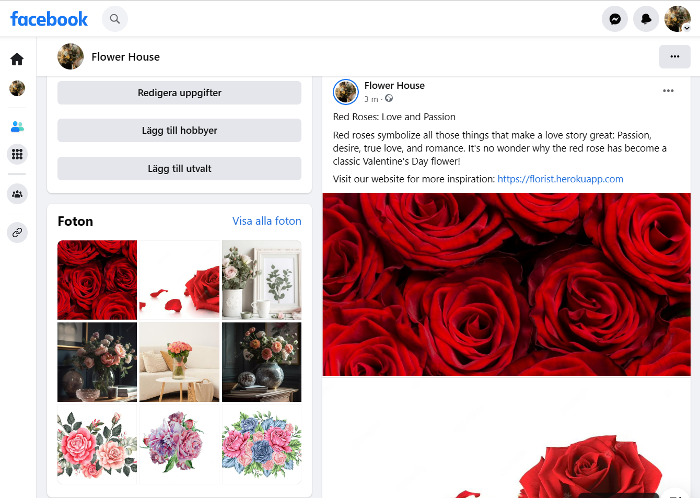
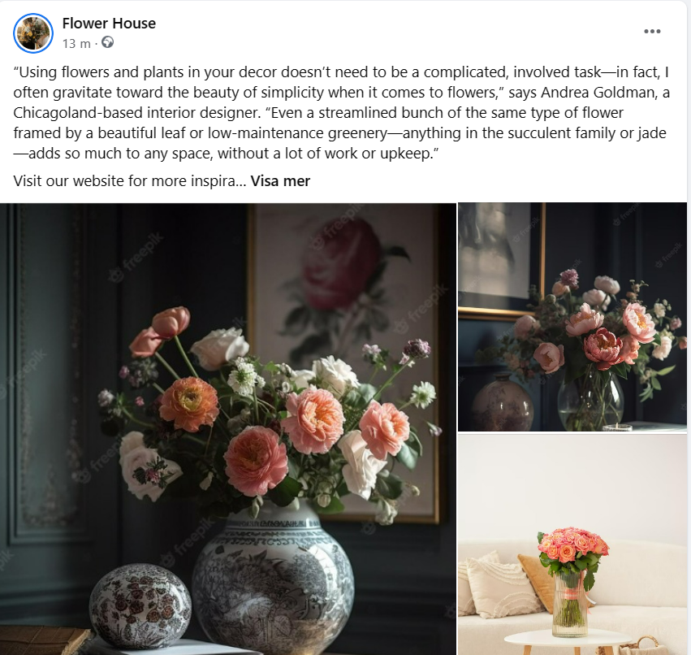

# Flower house

[View the live project here](https://flowerhouse-3853febb8d54.herokuapp.com/)
Here is the E-commerce Applications for Flower House created in Django for Portfolio Project 5 - Python + Django Essentials for Diploma in Full Stack Software Development at [Code Institute](https://codeinstitute.net/se/).

Here is a project built with a full stack site based on business logic used to control a central dataset. The mechanism is configured for authentication and provides paid access to site data and data such as product purchase.

This is e-commerce application which is built to make it easy for customers to find the products they are looking for. There sells bridal bouquet, flower bouquets, summer flowers, cut flowers, roses, tulips and pots. The products are placed in different categories, so that the customer can easily find what they are looking for. The customer can also create their own bouquet by filling out a simple form. The site is designed to encourage the customer to buy.

 # Table of content

 # User Experience (UX)
## USER STORIES:

[Kanban board](https://github.com/users/mariaarnesson/projects/18/views/1) with my defined [USER STORIES](https://github.com/mariaarnesson/florist_shop/issues) and their acceptance criteria are available here.

- USER STORY: SEO #1
  - As a **Site User** I can **find the site through web searches** so that I can **easily access the site**
- USER STORY: ERROR 404 OR 500 #2
  - As a **Site User efter http 404 or 500 response** I can **come back to the previous page and continue my shopping.**
- USER STORY: Facebook page #3
  - As a **Site User** I can **go to the Facebook page to currently follow the news of products in the flower shop.**
- USER STORY: Delete product #4
  - As a **Admin** I can **delete a product** so that **I can remove the product from the database.**
- USER STORY: Update details #5
  - As a **Admin** I can **edit or update details for a product**  so that **I can change the price.**
- USER STORY: Email confirmation #6
  - As a **Site User** I can **receive an email confirmation after checking out** so that **I have saved my purchases.**
- USER STORY: Total price #7
  - As a **Site User** I can **get confirmation after shopping** so that **I can see the total price.** 
- USER STORY: Payment details #8
  - As a **Site User** I can **enter my payment details** so **them keep safe.** 
- USER STORY: Checkout page #9
  - As a **Site User** I can **move on to the checkout page** so that **I can see the list of my purchases, total price** and also **enter my address details.**
- USER STORY: Manage shopping bag. #10
  - As a **Site User** I can **manage my shopping bag** so that **I can insert products I want to buy** and also r**emove them from the shopping bag.** 
- USER STORY: Search #11
  - As a **Site User** I can **use the search function** so that **I can see if the product I am looking for is available.**
- USER STORY: Selecting product #13
  - As a **Site User** I can **see pictures of all products** so that **I can select one of them** and **see product details.**
- USER STORY: Profil page #14
  - As a **Site User** I can **log in into the profil page** and **enter personal details.**
- USER STORY: Password #15
  - As a **Site User** I can **get an email with my password if I had forgotten it** so that I can log in again.
- USER STORY: Quanity of products #16
  - As a **Site User** I can **enter the number of products in the bag** so that I **can easily change the quantity** and **move on to the payment page.**
- USER STORY: User can log in #18
  - As a **Site User** I can **register or login** so that **I can manage my booking requests.**
- USER STORY: Account registration: #19
  - As a **Site User** I can **register an account**
- USER STORY: Registration #20
  - As a **Site User** I can **register** by **entering my email, password and confirming my password.**
- USER STORY: Login #21
  - As a **Story User** I can **log into the website** by **entering my email/username and password**
- USER STORY: Navigation bar #22
  - As a **Site User** I can **use navigation menu** to **switch to other options**
- USER STORY: Admin account #23
  - As a **Admin** I can **access to all products details**

# Features
## Existing Features

### Navigation bar   
Below are descriptions of the main features of the application. Many of the features are based on the Boutique Ado walkthrough project and SEO and Web Marketing modules of the course.

The navigation bar is structured as follows:
- on the left side, in the first place, there is an option: 'About us', after pressing it, the user can see information about the florist.
- another of the option is a blog, where the user can see the news about the florist, as well as discounts and other curiosities.
- next is a dropdown called: 'Shop' from the behavior of products for sale.
- after that there is the 'search' option where the user can search for a specific product, or just any word that is used in the product description, by which the user can easily find what needs.
- If the user is not authenicated, he/she should see two buttons on the right side:
    - Log in
    - Sign up
If the user is authenicated, on the right side should be:
- dragdown with the user's icon and the username, after pressing on it, the user can choose one of the options:
    - User Profile
    - Log out
- icon with a handbag, after pressing on it, the user can go to the page with the list of products that the user has added to the basket.

- This is what the navigation bar looks like when a user is logged in:

- This is what the navigation bar looks like when a user is not logged in:

#### Home Page

#### Prodcts Page
- In a very simple way, using the navigation bar, the user can see all the products, or if she/ he prefers, go straight to a specific category, or use the search option to find what the user wants. The list of products available on the page for purchase includes: product name, price, category, rating. At the top of the page can user also see how many products are on the page.

##### All Products:

##### Products Categories
  When the user selects one of the categories, the category photo, title and description are displayed. All products from the given category are displayed below:

  - Products in category Birthday flower.
  

   - Products in category Bouquets.

  
  

  - Products in category Wedding flowers.

  

### Product Detail Page

On the product details page, the user has access to see a larger size image of the product, and other details such as: 
  - a heart icon which make a user possibility to add a product to favorites page.
  - title of the product
  - price of the product 
  - product's category
  - rating
  - product's description

 Below that the user has the opportunity to rating the product and leave own review. 
 Below that is the possibility to order a quantity of the product. 
 At the very end, the user should choose whether he/she wants to continue to the page with the ordered products, or stay on the product page to add more products to the basket.

#### If a user is not authenticated:

A user who is not logged in can see the products existing on the site and the product details page. However, the products will not be added to the bag. The user cannot leave a review before logging in.

When the user presses the heart icon, the modal with the message below is displayed:

#### If a user is authenticated:

When a user is logged in, he has the ability to leave a review, edit and delete it. By pressing the heart icon, the product is added to the favorites page, and by selecting the quantity and pressing the 'ADD TO BAG' button, the product is added to the bag.

### Product Management

On the 'Product Management' page, the Site Administrator has the ability to add, edit or remove a product available for purchase.

### Blog Page

## Diagram

## Wireframes
- [Home Page- Desktop](media/wireframes/homepage_desktop.png)
- [Products- Desktop](media/wireframes/products_desktop.png)
- [Product Detail Desktop](media/wireframes/product_detail_desktop.png)

# Testing 

Testing information can be found in separate [TESTING.md](TESTING.md) file. 

# Deployment:

## Deploying the app to Heroku

### Create a Heroku app.
To create a [Heroku](https://dashboard.heroku.com) application, after log in, on the main page you should press the button: 'New', which is located on the upper right side. From the dropdown you should select: 'Create new app' option. Then you go to the next page, where you should fill a form with the following data: 'App name' and 'Choose a region', and then you should press button: 'Create app'.

Once the Heroku app is created, the next step is to go to option: 'settings'. In the category called 'Config Vars', you should press 'Reveal Config Vars' button, and then you have possibility to enter the KAY and VALUE for individual properties of:

- DATABASE_URL:

To create DATABASE_URL, you need log in to the [ElephantSQL](https://www.elephantsql.com/). On the top right side of this page, you need to press button: 'Creata New Instance'. Then you need to fill out a short form, where you select a plan and name. After that you should press 'Select Region'button. After entering the region, press the button: 'review' and then your instance is created. On your instance's panel, you can see the details. Then you should copy the link, which is placed next to option 'URL'. 

This link is needed to enter as VALUE to KEY - DATABASE_URL to Config Vars on Heroku.

- SECRET_KEY

To create a SECRET_KEY you can use the [Django Secret Key Generator](https://miniwebtool.com/django-secret-key-generator/). You should press a button: 'Generate Django Secret Key' and copy Generated Django Secret Key.

This key is needed to enter as VALUE to KEY - SECRET_KEY to Config Vars on Heroku.

- DISABLE_COLLECTSTATIC

Value of DISABLE_COLLECTSTATIC should be 1

- PORT
Value of PORT should be 8000.

## Creating a respository on GitHub

[GitHub Full Template](https://github.com/Code-Institute-Org/gitpod-full-template) was used to create my project. The green dropdown placed on the top right side on this page: 'Use this template' was pressed. After that 'Create a new respository' button was selected. After that you will be taken to another page, on a tab: 'Owner*', is your username selected, on a tab: 'Repository name*' you should give a name to your repository. Bellow that, in a tab 'Description (optional)' you have possibility to give your repository a short description.
Below that, there is an option to choose to make your repository private or public.
Finally, when everything is filled, you should press the button: 'Create repository'.

On the [GitPod Page](https://gitpod.io/workspaces), on the top right side, there is a button: 'New Workspace'. After selected that, you can add a new workspace. In a tab 'Select a repository', you can paste URL link to your repository, which you have built before. After that, eneter button 'Continue', and the workspace will start to build. You have to wait a while the workspace builds up.
Next you should install Django and supporting libraries:
1. Install Django and gunicorn with command in terminal: 'pip3 install django gunicorn'
2. Install supporting libraries with command in terminal: 'pip3 install dj_database_url psycopg2'

4. Create requirements file with command in terminal: 'pip3 freeze --local > requirements.txt'
5. Create Project with command in terminal: 'django-admin startproject PROJ_NAME .'
6. Create App with command in terminal: 'python3 manage.py startapp APP_NAME'

Now you should create a new env.py file on top of directory level and include database:
- import os library by typing 'import os' on the top in env.py file.
- now you should set environment variables by typing:
    - os.environ["DATABASE_URL"] = "Paste the same value as pasted in Heroku Config Vars"
    - os.environ["SECRET_KEY"] = "Paste the same value as pasted in Heroku Config Vars"
    

Now you should create Procfile on the top level directory and type 'web: gunicorn PROJ_NAME.wsgi'.

## Connecting the Heroku application to the GitHub repository

On the [Heroku page](https://dashboard.heroku.com), select the panel of your application that you have already created and press 'deploy'. Under the 'Deployment method' category, select the option: 'Connect to GitHub'. Below you will find: 'Search for a repository to connect to'. Bellow that enter your GitHub username, and your repository name, then press button: 'Search'. Underneath you should see the name of your GitHub respository and a 'Connect' button. Now there are two options to choose: either use 'Automatic deploys' or 'Manual deploy'.

I use the option: 'Manual deploy'. Next to a option: 'Choose a branch to deploy', select: 'main' and press button: 'Deploy Branch'. You have to wait a while while branch main builds up. When the branch is build and completed successfully, you will see a message: 'Your app was successfully deployed' and a button: 'View'. Enter 'View' to see the live project.
The live link can be found here - [View the live project here](https://flowerhouse-3853febb8d54.herokuapp.com/).

## The final steps that should be taken to deploy the application:

- The application can be prepared for Heroku deployment, when code changes have been completed and tested on localhost.

    - in settings.py the DEBUG flag should be set to False.
    - in settings.py 'X_FRAME_OPTIONS' should be set to 'SAMEORIGIN'.
    - use the command: 'pip3 freeze --local > requirements.txt' to make the requirements.txt file up-to-date.
    - Config Vars 'DISABLE_COLLECTSTATIC' in Heroku should be now deleted. 
    - On the Heroku dashboard go to the Deploy tab for the application and click on deploy branch.

## Detailed desciption steps to clone the repository:
- go to this page: https://flowerhouse-3853febb8d54.herokuapp.com/
- press button 'Code' and copy the link placed under HTTPS.
- after opening GitBush terminal, you should navigate to the directory and locate the clone. 
- to begin the clone process, on the command line, type "git clone" then paste in the copied url and press the Enter key.
- use the command : pip install -r requirements.txt to install the packages required by the application. 
- set DEBUG=True in the settings.py file, to developing and running the application locally.
- using the following commands, changes made to the local clone can be pushed back to the repository:
    - git add . (or filenames)
    - git commit -m "describe a message with changes that have been made"
    - git push
- N.B. Any changes pushed to the master branch will take effect on the live project once the application is re-deployed from Heroku

# SEO
To find the relevant keywords for my project I made the following searches on Google and Word Tracker along with a few combinations:

- Flower shop
- Flowers
- Bouquets 
- Sale 
- London 
- Home delivery 
- Occassions 
- Buy online 
- Summer flowers
- Flower for every occassion
- Create your own bouquets
- Florist in the heart of London
- A section of beautifule flowers for wedding
- Fresh products delivered to your home

Of the above, the top combination of searches I found were: 

- Flower shop near me
- Send flowers
- Unique bouquets
- Home delivery flowers London
- Special occassion
- Spring wedding flowers UK
- Sale florist
- London flowers delivery
- Bouquets of flowers
- Long-lasting summer flowers
- Flower for every session
- Flowers for everyone
- Best flowers to give a girl
- What flowers represent each month
- occassin to give flowers
- Designe your own bouquet online
- Create your own bouquet virtual
- Event Florists London
- Beautifule flowers for home
- Fresh products delivery to your door
- Good Luck flowers for wedding
- Best florist in London 

Of the above searches "Flwer shop near me" best suited what my project is selling and had the highest search rate of all keywords attempted. With that in mind, I have selected the following to be included in my projects metadata: 

- Flower shop near me
- Send flowers
- Unique bouquets
- Home delivery flowers London
- Special occassion
- Spring wedding flowers UK
- Long-lasting summer flowers
- Flowers for everyone
- Best flowers to give a girl
- Designe your own bouquet online
- Event Florists London
- Beautifule flowers for home
- Fresh products delivery to your door

Also, I included "Send Flowers" within the homepage message’ along with a subheading of "Home delivery flowers London".

# Marketing Strategies

1. Would your users use social media? If yes, which platforms do you think you would find them on? 
    - Instagram. 

       - Users can get inspiration from the instagram platform, showing photos with the title "How to decorate the interior with flowers?". And also included useful information about flowers and how to care for them. 

       - Video clips are posted for various occasions, such as a wedding or birthday party where flowers are prominently featured. 

    - Facebook. 
    
      -  Users can get inspiration from the instagram platform, showing photos under the title "How to decorate the interior with flowers?". And also included useful information about flowers and how to care for them. 

      - Video clips are posted for various occasions, such as a wedding or birthday party where flowers are prominently featured. 

    - Event Decor. 
      - The Event Decor function is a blog where large amounts of photos and information about flowers are also posted. 
      - Contests would be held where the winner could win a gift card. 

    - Email. Promotions and inspirations are sent to the user's e-mail. Large pictures are posted and discounted prices are posted in larger fonts to catch the recipient's attention. 

2. Would your business run sales or offer discounts? How do you think your users would most like to hear about these offers? 
    - Promotions are updated every week. 
    - Gift cards
    - Gift baskets
    - Free shipping on purchases over $50

3. What do your users need? Could you meet that need with useful content? If yes, how could you best deliver that content to them?

Users need flowers for home. With the help of the text and its content, I could present:
 
- How flowers have a positive effect on our mood
- How beautiful they can decorate the house
- What different flowers mean
- what flowers are best to buy for girls
- suggestions for bouquets of flowers for weddings and other parties
- Information and good advice on how to handle flowers correctly way.
- Information that if a customer wants to know more about their flowers, they can contact us
- Information about how to keep cut flowers alive longer
-  Information about how to effectively dry flowers.
 
4. What are the goals of your business? Which marketing strategies would offer the best ways to meet those goals?

My company's goal is that customers buy often and a lot of products. I want to post something that catches the eye. I tried to make the interior of my website well-chosen, the colors were chosen to match the color of the flowers, the photos were carefully chosen to arouse people's curiosity.

- In order for people to visit my flower shop often, I would like to have a friendly atmosphere, which I could achieve by posting short posts that are interesting, sometimes funny, for my blogs, facebook and instagram.

- With every post, I would have to include a photo.
- My site would be updated very often under various titles such as "Valentine's Day", "Flowers for Mother's Day", "Flowers for Easter" with suggestions on which flowers to buy for a given occasion.
- Marketing types like facebook, instagram, email, blog would definitely help me in my goal.

## Facebook business page

This is evidence of either a real Facebook business page for the purposes of digital marketing:

## Credits 

- [Freepik](https://www.pexels.com/sv-se/)
- [Pexels](https://www.freepik.com/search?format=search&query=children)
- [Bouquet- description](https://urocznica.pl/letni-bukiet-kwiatow-inspiracje-i-cytaty/)
- [Wedding flowers- description](https://www.partyflowers.pl/2018/06/bukiet-slubny-do-czego-musi-pasowac-2/)
- [blog- roses](https://www.e-kwiaty.pl/blog/jak-dbac-o-kwiaty-ciete.html)
- [footer- content about delivery](https://www.bukiety.com/about)
- [image- bag is empty](https://img.freepik.com/free-vector/no-data-concept-illustration_114360-2506.jpg?w=1060&t=st=1687441450~exp=1687442050~hmac=ce019363ef95c3a93f0b9fbbff7b237774f69215e5591d6fa86fc8bdd77c49f3)
- [Red roses meaning- posted on Facebook Page](https://fiftyflowers.com/blogs/flowers/rose-color-meanings)
- [Home Decor with flowers- posted on Facebook Page](https://www.ftd.com/blog/five-ways-interior-designers-use-flowers)
- [description product rose](https://www.euroflorist.pl/bukiet-rozana-dama)
- [sunflowers description](https://www.bloomandwild.com/meaning-and-symbolism-of-sunflowers)
- [inpiration flower description](https://laflora.pl/)
- [Take care roses](https://www.floom.com/pages/how-to-care-for-cut-roses)

 

