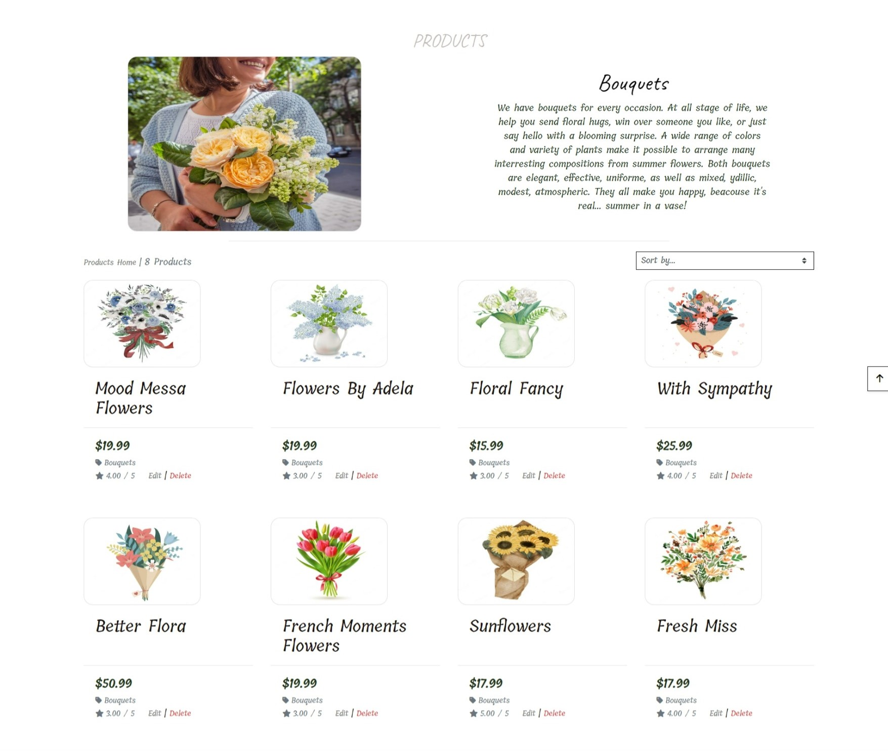

# Flower house

[View the live project here](https://flowerhouse-3853febb8d54.herokuapp.com/)
Here is the E-commerce Applications for Flower House created in Django for Portfolio Project 5 - Python + Django Essentials for Diploma in Full Stack Software Development at [Code Institute](https://codeinstitute.net/se/).

Here is a project built with a full stack site based on business logic used to control a central dataset. The mechanism is configured for authentication and provides paid access to site data and data such as product purchase.

This is e-commerce application which is built to make it easy for customers to find the products they are looking for. There sells bridal bouquet, flower bouquets, summer flowers, cut flowers, roses, tulips and pots. The products are placed in different categories, so that the customer can easily find what they are looking for. The customer can also create their own bouquet by filling out a simple form. The site is designed to encourage the customer to buy.

 # Table of content

 # User Experience (UX)
## USER STORIES:

- USER STORY: SEO #1
  - As a **Site User** I can **find the site through web searches** so that I can **easily access the site**
- USER STORY: ERROR 404 OR 500 #2
  - As a **Site User efter http 404 or 500 response** I can **come back to the previous page and continue my shopping.**
- USER STORY: Facebook page #3
  - As a **Site User** I can **go to the Facebook page to currently follow the news of products in the flower shop.**
- USER STORY: Delete product #4
  - As a **Admin** I can **delete a product** so that **I can remove the product from the database.**
- USER STORY: Update details #5
  - As a **Admin** I can **edit or update details for a product**  so that **I can change the price.**
- USER STORY: Email confirmation #6
  - As a **Site User** I can **receive an email confirmation after checking out** so that **I have saved my purchases.**
- USER STORY: Total price #7
  - As a **Site User** I can **get confirmation after shopping** so that **I can see the total price.** 
- USER STORY: Payment details #8
  - As a **Site User** I can **enter my payment details** so **them keep safe.** 
- USER STORY: Checkout page #9
  - As a **Site User** I can **move on to the checkout page** so that **I can see the list of my purchases, total price** and also **enter my address details.**
- USER STORY: Manage shopping bag. #10
  - As a **Site User** I can **manage my shopping bag** so that **I can insert products I want to buy** and also r**emove them from the shopping bag.** 
- USER STORY: Search #11
  - As a **Site User** I can **use the search function** so that **I can see if the product I am looking for is available.**
- USER STORY: Selecting product #13
  - As a **Site User** I can **see pictures of all products** so that **I can select one of them** and **see product details.**
- USER STORY: Profil page #14
  - As a **Site User** I can **log in into the profil page** and **enter personal details.**
- USER STORY: Password #15
  - As a **Site User** I can **get an email with my password if I had forgotten it** so that I can log in again.
- USER STORY: Quanity of products #16
  - As a **Site User** I can **enter the number of products in the bag** so that I **can easily change the quantity** and **move on to the payment page.**
- USER STORY: User can log in #18
  - As a **Site User** I can **register or login** so that **I can manage my booking requests.**
- USER STORY: Account registration: #19
  - As a **Site User** I can **register an account**
- USER STORY: Registration #20
  - As a **Site User** I can **register** by **entering my email, password and confirming my password.**
- USER STORY: Login #21
  - As a **Story User** I can **log into the website** by **entering my email/username and password**
- USER STORY: Navigation bar #22
  - As a **Site User** I can **use navigation menu** to **switch to other options**
- USER STORY: Admin account #23
  - As a **Admin** I can **access to all products details**

# Features
## Existing Features

### Navigation bar   
Below are descriptions of the main features of the application. Many of the features are based on the Boutique Ado walkthrough project and SEO and Web Marketing modules of the course.

The navigation bar is structured as follows:
- on the left side, in the first place, there is an option: 'About us', after pressing it, the user can see information about the florist.
- another of the option is a blog, where the user can see the news about the florist, as well as discounts and other curiosities.
- next is a dropdown called: 'Shop' from the behavior of products for sale.
- after that there is the 'search' option where the user can search for a specific product, or just any word that is used in the product description, by which the user can easily find what needs.
- If the user is not authenicated, he/she should see two buttons on the right side:
    - Log in
    - Sign up
If the user is authenicated, on the right side should be:
- dragdown with the user's icon and the username, after pressing on it, the user can choose one of the options:
    - User Profile
    - Log out
- icon with a handbag, after pressing on it, the user can go to the page with the list of products that the user has added to the basket.

- This is what the navigation bar looks like when a user is logged in:

- This is what the navigation bar looks like when a user is not logged in:

#### Home Page

#### Prodcts Page
- In a very simple way, using the navigation bar, the user can see all the products, or if she/ he prefers, go straight to a specific category, or use the search option to find what the user wants. The list of products available on the page for purchase includes: product name, price, category, rating. At the top of the page can user also see how many products are on the page.

##### All Products:

##### Products Categories
  When the user selects one of the categories, the category photo, title and description are displayed. All products from the given category are displayed below:

  - Products in category Birthday flower.
  

   - Products in category Bouquets.

  
  

  - Products in category Wedding flowers.

  

### Product Detail Page

On the product details page, the user has access to see a larger size image of the product, and other details such as: 
  - a heart icon which make a user possibility to add a product to favorites page.
  - title of the product
  - price of the product 
  - product's category
  - rating
  - product's description

 Below that the user has the opportunity to rating the product and leave own review. 
 Below that is the possibility to order a quantity of the product. 
 At the very end, the user should choose whether he/she wants to continue to the page with the ordered products, or stay on the product page to add more products to the basket.

#### If a user is not authenticated:

A user who is not logged in can see the products existing on the site and the product details page. However, the products will not be added to the bag. The user cannot leave a review before logging in.

When the user presses the heart icon, the modal with the message below is displayed:

#### If a user is authenticated:

When a user is logged in, he has the ability to leave a review, edit and delete it. By pressing the heart icon, the product is added to the favorites page, and by selecting the quantity and pressing the 'ADD TO BAG' button, the product is added to the bag.

### Product Management

On the 'Product Management' page, the Site Administrator has the ability to add, edit or remove a product available for purchase.

### Blog Page

 

